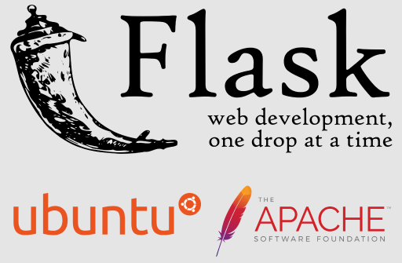

# README

Udacity Full Stack Web Developer Nanodegree program

[Project 6. Linux server deployment](https://github.com/br3ndonland/udacity-fsnd-p6-server)

Brendon Smith

[br3ndonland](https://github.com/br3ndonland)

<a href="https://m.do.co/c/8952af9c8fb4"></img></a>

**Use my [referral link](https://m.do.co/c/8952af9c8fb4) to get \$50 free credit on DigitalOcean!**

## Description

In this project, I configured an Ubuntu Linux server instance on [DigitalOcean](https://www.digitalocean.com/) and deployed a Flask app to the server. The app is available at [catalog.br3ndonland.com](https://catalog.br3ndonland.com).

- Software:
  - [Flask catalog application](https://github.com/br3ndonland/udacity-fsnd-flask-catalog)
  - Python >3.6
  - Pip
  - Modules
    - Flask
    - oauth2client
    - psycopg2
    - Requests
    - SQLAlchemy
- See [server-methods.md](info/server-methods.md) for computational narrative (walkthrough).
- Figure created in [Figma](https://www.figma.com) with logos from [Flask](http://flask.pocoo.org/community/logos/), [Ubuntu](https://design.ubuntu.com/brand/ubuntu-logo/), and [Apache](<https://en.wikipedia.org/wiki/File:Apache_Software_Foundation_Logo_(2016).svg>).
